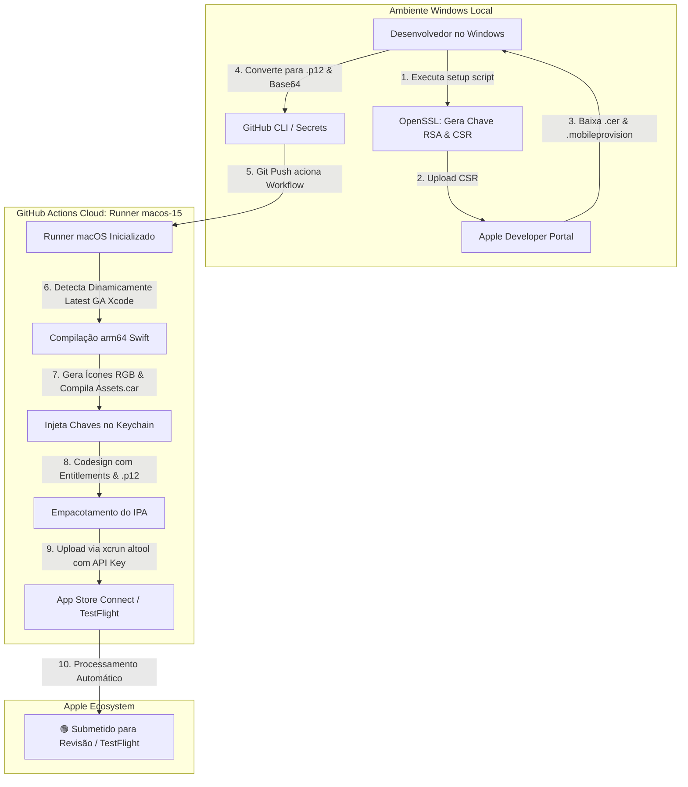

<div align="center">

# 🍏 iOS Windows to App Store Connect CI/CD

**Compilação, Assinatura e Publicação 100% Automatizada de Apps iOS diretamente do Windows para o App Store Connect via GitHub Actions.**

<p align="center">
  <a href="README.md"><b>English 🇺🇸</b></a> •
  <a href="README.pt-BR.md"><b>Português 🇧🇷</b></a> •
  <a href="README.es.md"><b>Español 🇪🇸</b></a>
</p>

[](https://github.com/features/actions)
[](https://developer.apple.com/xcode/)
[](https://developer.apple.com/ios/)
[](LICENSE)

*Sem Mac físico. Sem Hackintosh. Sem serviços caros de terceiros.*

</div>

---

## 📖 Sobre o Projeto

Desenvolver e publicar um aplicativo para a **Apple App Store** a partir de um computador **Windows** sempre foi um dos maiores desafios para desenvolvedores e empresas. 

Este projeto fornece um **kit completo de automação e modelo de CI/CD** baseado em **GitHub Actions** (usando runners oficiais `macos-15`), permitindo que qualquer desenvolvedor no Windows consiga:
1. Gerar certificados e chaves de assinatura da Apple (CSR, RSA 2048-bit, `.p12`) nativamente no Windows via OpenSSL.
2. Compilar binários nativos Swift/iOS para dispositivos físicos (`arm64`).
3. Gerar asset catalogs (`Assets.car`) e ícones 100% RGB sem canal alfa em conformidade com as regras da Apple.
4. Assinar digitalmente o aplicativo com *Distribution Certificate* e *Provisioning Profile*.
5. Fazer o upload automático para o **App Store Connect / TestFlight** através do `xcrun altool`.

---

## 🏗️ Fluxo e Arquitetura



---

## 🚀 Como Usar em 5 Minutos

### 1. Clonar ou copiar este repositório
Copie a pasta `.github/workflows/build-ios-appstore.yml` e `scripts/` para o repositório do seu projeto.

### 2. Executar o Script de Automação no Windows (PowerShell)
Abra o PowerShell na pasta do projeto e execute:

```powershell
.\scripts\setup-ios-appstore-cicd.ps1
```

O script interativo irá:
* Gerar sua chave privada RSA e o arquivo de requisição `CertificateSigningRequest.certSigningRequest`.
* Guiar o download do certificado `distribution.cer` e perfil `.mobileprovision` no portal da Apple.
* Exportar o certificado `.p12` protegido por senha.
* Codificar tudo em Base64 e configurar automaticamente todas as 6 secrets no seu GitHub!

---

## 🔐 GitHub Secrets Necessárias

Se preferir configurar manualmente em **Settings > Secrets and variables > Actions**:

| Nome da Secret | Descrição | Como Obter no Windows |
|---|---|---|
| `P12_CERTIFICATE_BASE64` | Certificado de Distribuição `.p12` em Base64 | `[Convert]::ToBase64String([IO.File]::ReadAllBytes("distribution.p12"))` |
| `P12_PASSWORD` | Senha definida na criação do arquivo `.p12` | Texto simples da senha |
| `PROVISIONING_PROFILE_BASE64` | Perfil de Provisionamento `.mobileprovision` em Base64 | `[Convert]::ToBase64String([IO.File]::ReadAllBytes("SeuApp.mobileprovision"))` |
| `APP_STORE_CONNECT_PRIVATE_KEY` | Conteúdo da chave de API (`AuthKey_XXXX.p8`) | Conteúdo completo do arquivo `.p8` |
| `APP_STORE_CONNECT_KEY_ID` | Key ID da API App Store Connect | Ex: `AB12CD34EF` (10 caracteres) |
| `APP_STORE_CONNECT_ISSUER_ID` | Issuer ID da API App Store Connect | Ex: `xxxxxxxx-xxxx-xxxx-xxxx-xxxxxxxxxxxx` (UUID) |

---

## 📁 Estrutura de Arquivos Recomendada

```text
├── .github/
│   └── workflows/
│       └── build-ios-appstore.yml       # Workflow completo de CI/CD para macOS
├── ios/
│   └── SeuApp/
│       ├── Info.plist                   # Metadados do App (CarPlay, Permissões, etc.)
│       ├── Package.swift                # Gerenciador de Pacotes Swift (ou .xcodeproj)
│       ├── Resources/
│       │   └── client_launcher.png      # Imagem base de 1024x1024 para ícones
│       └── Sources/
│           └── App/
│               └── SeuAppMain.swift     # Código-fonte da aplicação
└── scripts/
    ├── setup-ios-appstore-cicd.ps1      # Assistente de configuração (Windows PowerShell)
    └── setup-ios-appstore-cicd.sh       # Assistente de configuração (Linux / macOS / WSL)
```

---

## ⚙️ Principais Funcionalidades do Workflow

- ✅ **Detecção Dinâmica do Xcode GA**: Busca automaticamente a versão estável mais recente do Xcode instalada no runner macOS (`macos-15`), evitando incompatibilidades de versão beta da Apple.
- ✅ **Tratamento Automático de Ícones**: Gera ícones em todas as resoluções necessárias (120x120, 180x180, 152x152, 167x167, 1024x1024) com fundo RGB opaco (sem canal alpha) para cumprir as regras estritas da App Store.
- ✅ **Extração Dinâmica de Entitlements**: Decodifica o perfil `.mobileprovision` e extrai as permissões e entitlements oficiais antes da assinatura.
- ✅ **Keychain Efêmero Seguro**: Cria e destrói uma keychain temporária protegida no runner para importar o `.p12` e assinar com `codesign`.
- ✅ **Upload Direto sem Transporter GUI**: Utiliza a ferramenta oficial de linha de comando `xcrun altool` autenticada via chave privada `.p8`.

---

## 📝 Checklist de Submissão no App Store Connect

Antes de clicar em **Adicionar para Revisão (*Add for Review*)**:
- [ ] **Categoria Primária**: Definida em *Informações do App* (ex: Entretenimento ou Utilitários).
- [ ] **Direitos de Conteúdo**: Marcado como *Não*.
- [ ] **Classificação Indicativa (Age Rating)**: Questionário preenchido.
- [ ] **Privacidade do App**: Práticas e dados declarados.
- [ ] **Criptografia**: Certifique-se de que o `Info.plist` possui `<key>ITSAppUsesNonExemptEncryption</key><false/>`.
- [ ] **Screenshots**: Faça upload dos tamanhos obrigatórios (6.5" Display, 5.5" Display e iPad se aplicável).

---

## 🤝 Contribuições

Contribuições são super bem-vindas! Sinta-se livre para abrir uma **Issue** ou enviar um **Pull Request**.

---

## 📄 Licença

Distribuído sob a licença **MIT**. Consulte o arquivo [LICENSE](LICENSE) para obter mais informações.
